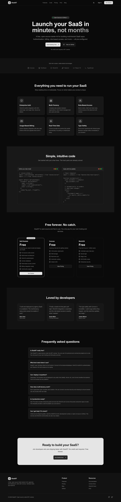

# iSaaSIT 🚀

**The open-source SaaS starter kit for agencies managing client companies.**

Launch your client portal with proper data isolation, team assignments, and billing—without rebuilding auth, tenancy, and billing infrastructure every time.

[](https://opensource.org/licenses/MIT)
[](https://react.dev/)
[](https://www.typescriptlang.org/)



---

## ✨ What Makes This Different

Most SaaS starter kits give you auth + billing. **iSaaSIT gives you multi-tenant client portals**—the architecture agencies actually need:

```
┌─────────────────┐
│   Your Agency   │  ← Org (Admin manages everything)
│   (Admin)       │
└────────┬────────┘
         │
    ┌────┴────┬────────┬────────┐
    ▼         ▼        ▼        ▼
┌───────┐ ┌───────┐ ┌───────┐ ┌───────┐
│Client │ │Client │ │Client │ │Client │  ← Customers (isolated data)
│   A   │ │   B   │ │   C   │ │   D   │
└───┬───┘ └───┬───┘ └───┬───┘ └───┬───┘
    │         │         │         │
   Staff    Staff     Staff      Staff   ← Team assignments
   (John)   (Jane)    (John)     (Jane)
```

**Three roles, proper isolation:**

- **Admin** - Manages agency, billing, all clients
- **Staff** - Access only to assigned client accounts
- **Client** - Access only to their own company data

---

## 🎯 Who Is This For?

iSaaSIT is built specifically for **agencies and service businesses** managing multiple clients:

| Business Type               | Use Case                                 |
| --------------------------- | ---------------------------------------- |
| 🎨 **Design Agencies**      | Client project portals with file sharing |
| 💼 **Consulting Firms**     | Client dashboards for deliverables       |
| 📊 **Accounting Practices** | Secure document exchange                 |
| 💻 **Development Shops**    | Client project management                |
| 📈 **Marketing Agencies**   | Campaign dashboards & reporting          |
| 🔧 **IT Services**          | Managed services client portals          |

**Perfect if you need:**

- ✅ Data isolation between clients
- ✅ Staff assigned to specific accounts
- ✅ Client portal login for customers
- ✅ Usage-based billing (per client/staff limits)

---

## 🚀 Features

### Core Platform

| Feature                  | Status   | Description                                             |
| ------------------------ | -------- | ------------------------------------------------------- |
| 🔐 **Enterprise Auth**   | ✅ Ready | WorkOS AuthKit with SSO, social login, magic links      |
| 🏢 **Multi-tenant Orgs** | ✅ Ready | Complete data isolation between agencies                |
| 👥 **Role-based Access** | ✅ Ready | Admin / Staff / Client roles with different permissions |
| 📊 **Dashboard**         | ✅ Ready | Agency overview with usage stats                        |
| ⚙️ **Settings**          | ✅ Ready | Org configuration & preferences                         |

### Client Management

| Feature                  | Status   | Description                                          |
| ------------------------ | -------- | ---------------------------------------------------- |
| 🏢 **Customer CRUD**     | ✅ Ready | Create, manage client companies                      |
| 👤 **Staff Assignments** | ✅ Ready | Assign team members to specific clients              |
| 🔒 **Data Isolation**    | ✅ Ready | Staff/clients only see their data (backend enforced) |
| 🔍 **Search & Filter**   | ✅ Ready | Find customers quickly                               |

### Team & Invites

| Feature                  | Status   | Description                       |
| ------------------------ | -------- | --------------------------------- |
| 📧 **Email Invitations** | ✅ Ready | Invite staff & clients via WorkOS |
| 🎭 **Role Assignment**   | ✅ Ready | Set role during invitation        |
| 📋 **Pending Invites**   | ✅ Ready | Track and manage invitations      |
| 🚫 **Soft Delete**       | ✅ Ready | Remove users without data loss    |

### Billing

| Feature                | Status   | Description                                |
| ---------------------- | -------- | ------------------------------------------ |
| 💳 **Polar**           | ✅ Ready | Subscription billing integration           |
| 📈 **Usage Caps**      | ✅ Ready | Enforce limits (customers, staff, clients) |
| 🔄 **Plan Upgrades**   | ✅ Ready | Self-service checkout                      |
| 🧾 **Customer Portal** | ✅ Ready | View invoices, manage subscription         |
| ⚠️ **Limit Warnings**  | ✅ Ready | UI alerts when approaching caps            |

### Developer Experience

| Feature            | Status   | Description                  |
| ------------------ | -------- | ---------------------------- |
| 📘 **Type Safety** | ✅ Ready | End-to-end TypeScript        |
| 🤖 **AI Skills**   | ✅ Ready | 6 Claude Code skills bundled |
| 🎨 **shadcn/ui**   | ✅ Ready | 25+ accessible components    |
| 🔄 **Real-time**   | ✅ Ready | Live data updates via Convex |
| 📱 **Responsive**  | ✅ Ready | Works on all screen sizes    |

---

## 🛠️ Tech Stack

| Layer        | Technology                  | Why                                       |
| ------------ | --------------------------- | ----------------------------------------- |
| **Frontend** | React 19 + TanStack Start   | Modern React with SSR, file-based routing |
| **Backend**  | Convex                      | Real-time database, serverless functions  |
| **Auth**     | WorkOS AuthKit              | Enterprise-grade, SSO-ready               |
| **Styling**  | Tailwind CSS v4 + shadcn/ui | Utility-first, accessible components      |
| **Billing**  | Polar                       | Subscription billing with webhooks        |
| **Build**    | Vite 7                      | Fast dev, optimized production            |

---

## 📦 Quick Start

```bash
# 1. Clone & install
git clone https://github.com/Kieransaunders/iSaaSIT.git
cd iSaaSIT
npm install

# 2. Copy environment template
cp .env.local.example .env.local

# 3. Set up services (see detailed guide below)
npx convex dev  # Creates Convex deployment

# 4. Start development
npm run dev
```

Open [http://localhost:3000](http://localhost:3000) 🎉

**📖 Detailed Setup**: See [SETUP.md](SETUP.md) for step-by-step instructions with screenshots.

**🚀 Deployment**: See [DEPLOYMENT.md](DEPLOYMENT.md) for production deployment.

---

## ⚡ Optional: Enable Paid Plans

The app works great on the **free tier** (3 customers, 2 staff, 10 clients). To enable paid plans with Polar:

```bash
# 1. Optional UI hint
VITE_POLAR_SERVER=sandbox

# 2. Set Convex environment variables
npx convex env set POLAR_ORGANIZATION_TOKEN your_organization_token
npx convex env set POLAR_WEBHOOK_SECRET your_webhook_secret
npx convex env set POLAR_SERVER sandbox
npx convex env set POLAR_PRO_MONTHLY_PRODUCT_ID your_pro_monthly_product_id
npx convex env set POLAR_PRO_YEARLY_PRODUCT_ID your_pro_yearly_product_id
npx convex env set POLAR_BUSINESS_MONTHLY_PRODUCT_ID your_business_monthly_product_id
npx convex env set POLAR_BUSINESS_YEARLY_PRODUCT_ID your_business_yearly_product_id
```

See [SETUP.md](SETUP.md) for detailed billing configuration instructions.

---

## 📁 Project Structure

```
├── src/
│   ├── routes/              # TanStack Router file-based routes
│   │   ├── index.tsx        # Landing page
│   │   ├── onboarding.tsx   # Org creation flow
│   │   ├── callback.tsx     # WorkOS OAuth callback
│   │   └── _authenticated/  # Protected routes
│   │       ├── dashboard.tsx
│   │       ├── customers.tsx
│   │       ├── team.tsx
│   │       ├── billing.tsx
│   │       └── settings.tsx
│   ├── components/          # React components
│   │   ├── ui/              # shadcn/ui components
│   │   ├── layout/          # App layout components
│   │   └── billing/         # Billing-specific components
│   ├── config/              # Configuration files
│   └── lib/                 # Utility functions
│
├── convex/                  # Convex backend
│   ├── schema.ts            # Database schema
│   ├── auth.config.ts       # WorkOS JWT validation
│   ├── http.ts              # HTTP routes (webhooks)
│   ├── orgs/                # Organization functions
│   ├── customers/           # Customer CRUD
│   ├── users/               # User management
│   ├── invitations/         # Team invitations
│   ├── assignments/         # Staff-customer assignments
│   ├── billing/             # Billing queries & actions
│   ├── polar.ts             # Polar configuration
│
├── docs/                    # Documentation site (Starlight)
├── .cursor/                 # Cursor IDE rules
├── .claude/                 # Claude Code skills
└── .planning/               # Project planning docs
```

---

## 🤖 AI-Assisted Development

iSaaSIT is optimized for AI-assisted development. Bundled tools include:

### Claude Code Skills

All skills are pre-installed in `.claude/skills/`:

| Command          | Skill                                             |
| ---------------- | ------------------------------------------------- |
| `/convex`        | Backend patterns, queries, mutations              |
| `/tanstack`      | Routing, server functions, data fetching          |
| `/tailwind-v4`   | Styling with Tailwind CSS v4                      |
| `/shadcn-ui`     | Component usage and composition                   |
| `/ui-ux-pro-max` | Design system generator (50+ styles, 97 palettes) |

### GSD (Get Shit Done)

Meta-prompting system for spec-driven development:

```bash
# Already installed via npm install
/gsd:map-codebase     # Analyze codebase
/gsd:new-project      # Initialize spec-driven dev
/gsd:plan-phase 1     # Create execution plan
```

### Cursor Rules

Contextual rules in `.cursor/rules/`:

- Convex patterns
- TanStack Router conventions
- Authentication patterns
- Multi-tenancy guidelines

---

## 🚀 Deployment

### Deploy to Netlify

```bash
# Build for production
npm run build

# Deploy Convex
npx convex deploy
```

Add environment variables in Netlify dashboard:

- `WORKOS_CLIENT_ID`
- `WORKOS_API_KEY`
- `WORKOS_COOKIE_PASSWORD`
- `WORKOS_REDIRECT_URI` (your production URL)
- `VITE_CONVEX_URL`

### Update WorkOS Redirect URI

In WorkOS dashboard, add your production callback URL:

```
https://your-domain.com/callback
```

### Configure WorkOS Webhook (Invitations)

Invited users won’t be attached to an organization until the WorkOS webhook is delivered to Convex.

1. In the WorkOS Dashboard, add a webhook endpoint:
   - **Dev**: `https://<your-deployment>.convex.site/webhooks/workos`
   - **Prod**: `https://<your-prod-deployment>.convex.site/webhooks/workos`
2. Enable the `invitation.accepted` event.
3. Set the webhook secret in Convex:
   ```bash
   npx convex env set WORKOS_WEBHOOK_SECRET <secret>
   ```
4. Find your deployment URL in the Convex dashboard or the output of `npx convex dev`.

---

## 🗺️ Roadmap

### v1.0 (Current) ✅

- [x] Authentication & org management
- [x] Customer CRUD with data isolation
- [x] Team invitations (Staff/Client roles)
- [x] Staff-customer assignments
- [x] Usage-based billing with Polar
- [x] Dashboard & settings
- [x] Client-specific dashboard view

- [ ] Activity logs
- [ ] File uploads (Convex File Storage)
- [ ] Email templates
- [ ] API keys for customer integrations

### v2.0 (Planned)

- [ ] Admin console for platform management
- [ ] Webhook management
- [ ] Advanced reporting
- [ ] Custom fields for customers

---

## 🐛 Troubleshooting

### "Missing VITE_CONVEX_URL"

Run `npx convex dev` to set up Convex and get your deployment URL.

### "Authentication failed" / JWT errors

1. Ensure `WORKOS_CLIENT_ID` is set in both `.env.local` and Convex dashboard
2. Check that your redirect URI matches exactly (including http vs https)

### "Billing not configured" warning

This is expected if you haven't set up Polar. The app works fully on the free tier without billing configured.

### setup:check Tool

Run `npm run setup:check` to automatically validate your environment variables and configuration.

### npm install fails

Try with `--legacy-peer-deps`:

```bash
npm install --legacy-peer-deps
```

---

## 📄 License

MIT © [Kieran Saunders](https://github.com/Kieransaunders)

---

## 💬 Community

- **Issues**: [GitHub Issues](https://github.com/Kieransaunders/iSaaSIT/issues)
- **Discussions**: [GitHub Discussions](https://github.com/Kieransaunders/iSaaSIT/discussions)

---

<p align="center">
  Built with ❤️ for agencies who ship.
</p>
